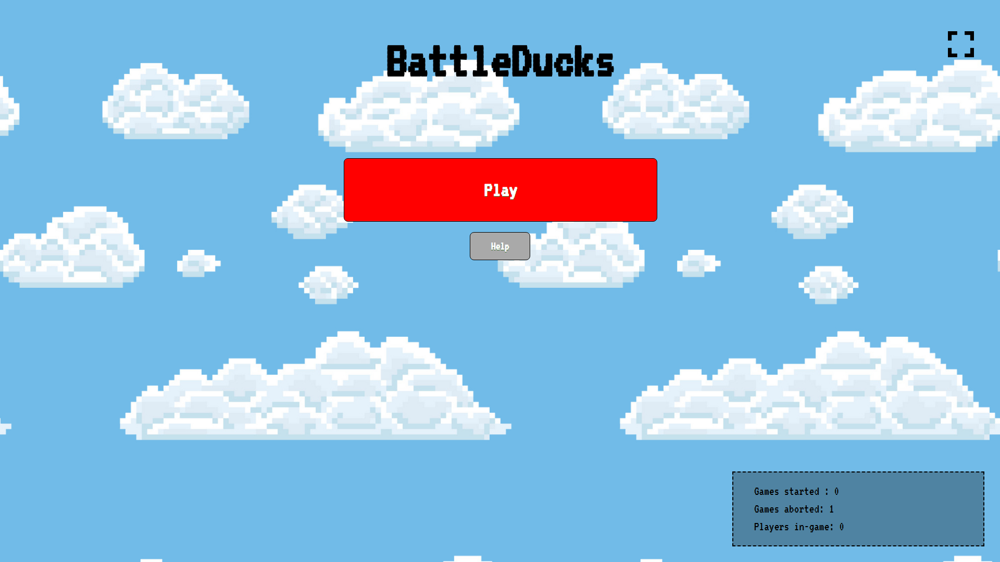
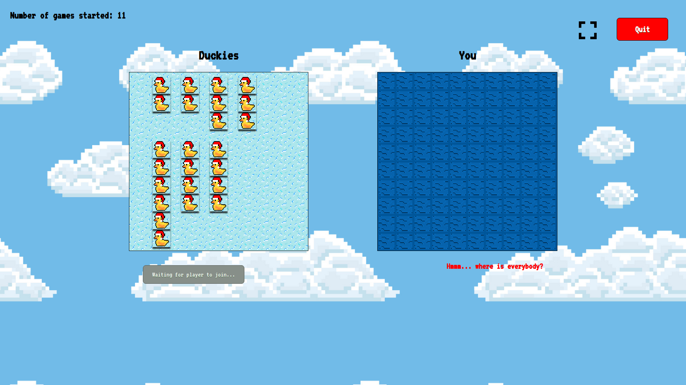

# BattleDucks
First year Computer Science and Engineering Web Technology project.
A multiplayer Battleship game using NodeJS with the Express framework.  

# How to start
1. Launch the server by typing `node app.js 8080` in your terminal 
(`8080` is the port and can be changed).
2. Then go to `http://localhost:8080/` and start playing.

# Project structure
Client side: `/myapp/public`

Server side; `/myapp/*.js` && `myapp/routes`
